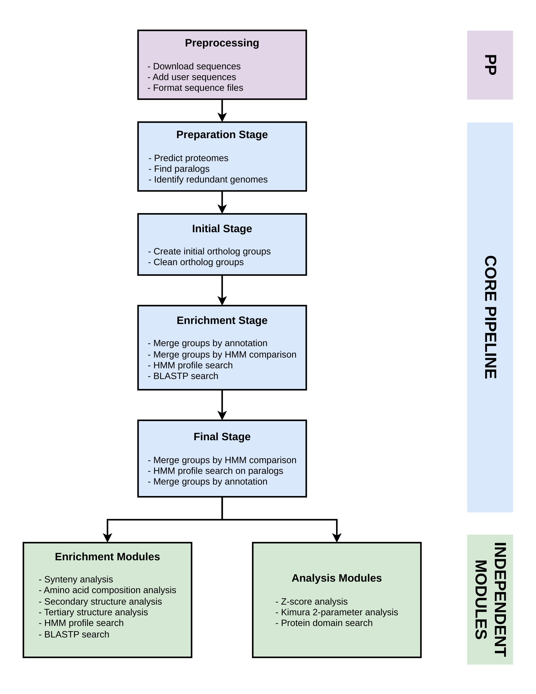

# Basic usage

## Workflow

ViralOrthology consists of a core orthology inference pipeline followed by optional enrichment and analysis modules **(Fig. 1)**. The workflow consists of three main steps:

1. **Preprocessing** — Prepare the input sequences by downloading the required sequences, adding user sequences, and formatting the sequence files.

1. **Core pipeline** — Run the core pipeline on the prepared sequences to infer and iteratively refine orthologous groups.

1. **Independent modules** — Further process the resulting groups using optional enrichment and analysis modules.

The **independent modules** can be run separately depending on the analysis requirements. **Enrichment modules** use complementary evidence, such as synteny conservation, amino acid composition, and protein structural information, while **analysis modules** can be used to examine the resulting groups, evaluate their quality, and extract additional information from the inferred relationships.


<p align="center"><em>Figure 1. Overview of the ViralOrthology workflow.</em></p>

## Basic run

### 1. Download sequences from GenBank

**Prepare the input**

Create a file named `ids.txt` containing the GenBank accession IDs of the viral genomes to be analyzed:

```text
NC_XXXXX
NC_XXXXX
NC_XXXXX
```

**Retrieve sequences**

```bash
viralorthology -download_seqs
```

<!--### Add user sequences # TODO-->

### 2. Run the core pipeline

```bash
viralorthology -pipeline
```

The core pipeline uses several bioinformatics tools whose parameters can be customized. For more information, see the [Tool Parameters](../usage/tool_parameters.md) section.

### 3. Run enrichment and analysis modules

Once the orthologous groups have been generated, independent enrichment and analysis modules can be executed as needed.

## Enrichment modules

**Status:** In progress — documentation pending.

## Analysis modules

**Status:** In progress — documentation pending.
